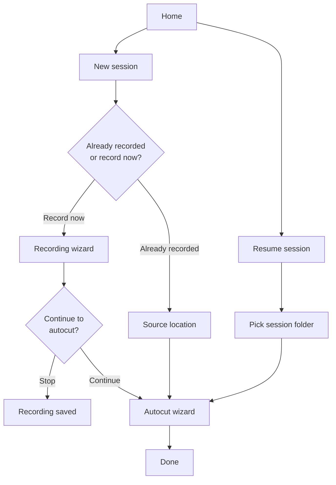

# Podcast in a Box App — architecture

Standalone GUI for the Lighthaven walk-in podcast room. **Proof-of-concept:** one Windows machine, self-contained, guides users through record → autocut → optional email delivery.

**Backend:** existing PIAB scripts in this repo (`scripts/piab_*.py`, harness helpers).  
**Frontend:** PySide6 wizard in a single window.  
**App repo:** `E:\PodcastRoom\PodcastInABox`. Session files, the process log, job queue, and app lock live in `E:\PodcastRoom\PodcastInABox\Sessions`.  
**Fallback pipeline (unchanged):** `E:\PodcastRoom\Cursor\automated-video-editing` @ `lighthaven-podcast-in-a-box`.

---

## Goals

| Goal | Detail |
|------|--------|
| Walk-in usability | Simple linear wizard; no Cursor agent, no Explorer pop-outs |
| Record or return later | **Record now** or **Already recorded** (folder with MultiCorder files) |
| Optional delivery | Email when done, or files on disk only (memory stick) |
| Auto-named sessions | Folder name generated; **full path shown** when autocut starts and on the done screen |
| Testable core | Controller runs without GUI (CLI + pytest) |
| Safe operation | No accidental close, duplicate recording, or silent overwrites |

---

## Technology

**PySide6** (Qt for Python) — official Qt binding, LGPL-friendly, good fit for:

- Thumbnails and reference images (`QPixmap`, `QLabel`)
- Audio preview clips (`QMediaPlayer`)
- 1-minute test review (`QVideoWidget` + `QMediaPlayer`)
- Background jobs (`QProcess` in GUI; `subprocess` in controller)
- Wizard flow (`QStackedWidget`)

The GUI is a thin layer over a **headless controller** with no Qt imports.

---

## Layer split

```
┌─────────────────────────────────────┐
│  GUI (PySide6)                      │
│  screens, dialogs, media widgets    │
└──────────────┬──────────────────────┘
               │ signals / method calls only
┌──────────────▼──────────────────────┐
│  PiabController (stdlib + scripts)  │
│  state machine, jobs, preflight     │
└──────────────┬──────────────────────┘
               │ subprocess / import
┌──────────────▼──────────────────────┐
│  Existing scripts (piab_*.py, etc.) │
└─────────────────────────────────────┘
```

### Package layout (planned)

```
app/
  main.py                   # PySide6 entry point
  gui/
    main_window.py          # QStackedWidget shell
    screens/                # one module per screen tier
    widgets/                # video grid, audio row, path banner
  controller/
    __init__.py
    controller.py           # PiabController
    preflight.py
    jobs.py                 # JobRunner, Job, abort
    session_store.py        # podcast-in-a-box.json
    lock.py                 # app singleton + recording lock
    overwrite.py            # wrap harness_overwrite_guard
    resume_router.py        # resume_at → screen ID
  cli.py                    # python -m app.cli preflight | ...
tests/
  test_controller.py
  test_preflight.py
  ...
docs/
  piab-app-architecture.md  # this file
```

### Independent testing

The controller exposes a CLI (same API the GUI uses):

```powershell
python -m app.cli preflight
python -m app.cli sessions
python -m app.cli resume --folder "E:\PodcastRoom\PodcastInABox\Sessions\2026-07-28_1545"
python -m app.cli auto-name
python -m app.cli check-overwrite --folder "..." --action run_prep
python -m app.cli start-prep --folder "..." --wait
python -m app.cli abort --job <id> --yes
python -m app.cli lock --acquire
python -m app.cli busy
```

Implementation: `app/controller/` (see build order below). Run tests:

```powershell
python -m unittest discover -s tests -v
```

---

## User-facing requirements

| Requirement | App behavior |
|-------------|--------------|
| Return later with files | **Already recorded** → default folder (newest cluster) or **special folder** path picker |
| Auto-named folders | Pattern `YYYY-MM-DD_HHMM`; collision → `_2`, `_3`, … |
| Show folder path | Banner on **session ready**, **processing**, and **done** screens |
| Email optional | Ask on **C1**; **No** = disk-only through to **F5** |
| Single window | All previews, playback, and paths in-app — no `explorer.exe` |

### Auto-name rule

- Format: `YYYY-MM-DD_HHMM` (local time), e.g. `2026-07-28_1545`
- Created under `E:\PodcastRoom\PodcastInABox\Sessions\<auto-name>\` (default mode)
- Special folder: user-supplied path **is** the session folder (existing layout)

---

## High-level navigation



---

## Screen catalog

Each screen is one page in a `QStackedWidget`. **Screen ID** is used by the GUI router; **`resume_at`** comes from `podcast-in-a-box.json`.

### Tier A — App entry

| Screen ID | Title | Purpose |
|-----------|-------|---------|
| **A0** | Preflight | Prerequisites checklist (see [Preflight](#preflight)) |
| **A1** | Welcome | **New session** / **Resume session**. Autocut queue plus **On hold** (jobs removed from auto-process; **Resume** puts them back). |
| **A2** | Resume — pick session | Recent PIAB folders that still have `Raw/` + **Browse…**. `Preview Files/` alone is not enough. |
| **A3** | New — record or autocut? | **Record now** / **Already recorded** |

### Tier B — Recording flow

Only when user chooses **Record now**. Uses `PIAB_USE_CONTINUE_BUTTON=1` + `continue_event` for **B3** and **B4**.

| Screen ID | Title | Backend |
|-----------|-------|---------|
| **B1** | vMix | `piab_ensure_vmix.py` |
| **B2** | vMix preset | `piab_open_vmix_preset.py` |
| **B3** | Camera & mic setup | `confirm_camera_setup(continue_event=…)` |
| **B4** | Recording | `run_multicorder_session(continue_event=…)` — **Abort** available |
| **B5** | Recording complete | **Continue to autocut** / **Stop — save files only** |
| **B6** | Files saved (no autocut) | Files in `E:\PodcastRoom`; no session subfolder |

### Tier C — Session setup (autocut begins)

| Screen ID | Title | Maps to `resume_at` |
|-----------|-------|---------------------|
| **C1** | Delivery (optional) | Writes `delivery` in state |
| **C2** | Source location | **Already recorded** only: default vs special folder |
| **C2a** | Confirm source files | `01_scan_confirm` |
| **C3** | Creating session… | `02_create_folder` |
| **C4** | Session ready | **Show full path** → `03_label_videos` |

After **B5 → continue**: skip **C2**; scan newest default-folder cluster; auto-name; show **C4**.

If special folder already contains `podcast-in-a-box.json`, treat as **Resume** (A2).

### Tier D — Labeling & prep approval

| Screen ID | Title | Maps to `resume_at` |
|-----------|-------|---------------------|
| **D1** | Label cameras | `03_label_videos` |
| **D2** | Label microphones | `04_label_audio` |
| **D3** | Apply labels | → `05_estimate_prep` |
| **D4** | Estimate A | `05_estimate_prep` |

### Tier E — Processing (background)

| Screen ID | Title | Maps to `resume_at` (internal) |
|-----------|-------|--------------------------------|
| **E1** | Processing… | `06` … `10` while `piab_run_prep.py` runs — **Abort** available. If waiting in queue: **Hold Outside Queue** parks the job (no auto-start). |

User-visible substep labels:

| Step ID | Label |
|---------|-------|
| `06_conversation_sync` | Syncing audio |
| `07_deroom_placeholder` | Preparing clean audio |
| `08_video_sync` | Syncing video |
| `09_transcribe` | Transcribing (ElevenLabs) |
| `10_one_min_test` | Rendering 1-minute preview |

Poll `podcast-in-a-box.json` (`steps`, `resume_at`) and `Temp/harness-FAILURE.json`.

### Tier F — Review & full render

| Screen ID | Title | Maps to `resume_at` |
|-----------|-------|---------------------|
| **F1** | Something went wrong | Failed step / abort |

On any autocut step failure (prep, Fast Preview, or full render): an application-modal popup says the autocut failed and a bug report was submitted, and that original files are safe. `notify_harness_failure` also emails **lighthavenpodcastroom@gmail.com** with subject **PIAB autocut error** and that session’s process-log row plus `Temp/harness-FAILURE.txt`. User abort and overwrite-blocked (files already exist) do not send a bug report.
| **F2a** | Sync offset A/B choice | `10a_sync_offset_approval` — side-by-side players |
| **F2** | Review 1-minute test | `11_one_min_approval` |
| **F3** | Estimate B | `12_estimate_full` |
| **F4** | Rendering full interview… | `13_full_render` — **Abort** available. If waiting in queue: **Hold Outside Queue**. |
| **F5** | Done | `14_done` |

**F2 actions:**

| Button | Backend |
|--------|---------|
| Looks good | → **F3** |
| Host/Guest audio or cameras swapped in edit | `piab_fix_audio_speaker_swap.py --allow-overwrite` (GUI: **Host/Guest swapped in edit**) |
| Wrong Raw Host/Guest files (mislabeled during labeling) | `piab_swap.py --files …` → **D1** / **D2** |

### Tier F5 — Done variants

Always show session folder path.

| Delivery | Message |
|----------|---------|
| Email yes | “Check your email at …” + files in `E:\PodcastRoom\PodcastInABox\Sessions\<name>` |
| Email no | Path to `Output\Full Interview.mp4` + memory-stick reminder |
| Recording only (**B6**) | Files in `E:\PodcastRoom` (no session folder) |

### Modals (not stacked pages)

| Modal | When |
|-------|------|
| Close while busy | Recording or processing active |
| Abort confirm | User presses **Abort** on B4 / E1 / F4 |
| Overwrite confirm | Controller reports paths at risk |

---

## Resume router

A session is resumable only when `podcast-in-a-box.json` has `kind=podcast_in_a_box`, `resume_at` is not `cleaned`, and **`Raw/` is still on disk**. After Clean Old Working Files, Resume hides the folder; Force new is the only option.

| `resume_at` | Open screen |
|-------------|-------------|
| `01_scan_confirm` | **C2a** |
| `02_create_folder` | **C3** |
| `03_label_videos` | **D1** |
| `04_label_audio` | **D2** |
| `05_estimate_prep` | **D4** |
| `06_conversation_sync` … `10_one_min_test` | **E1** (offer prep `--resume`) |
| `11_one_min_approval` | **F2** |
| `12_estimate_full` | **F3** |
| `13_full_render` | **F4** |
| `14_done` | **F5** |

---

## Example journeys

### Walk-in: record + autocut + email

`A0 → A1 → A3(record) → C1(email) → B1…B4 → B5(continue) → C4 → D1 → D2 → D4 → E1 → F2 → F3 → F4 → F5`

### Walk-in: record only (memory stick later)

`A0 → A1 → A3(record) → C1(no email) → B1…B4 → B5(stop) → B6`

### Return next day with a folder

`A0 → A1 → A3(already recorded) → C1 → C2(special) → C2a → C4 → D1 → … → F5`

### Power loss mid-prep

`A0 → A1 → A2(resume) → E1(auto-resume prep) → F2 → …`

---

## Cross-cutting requirements

### Controller usable without GUI

All lifecycle, preflight, jobs, overwrite checks, and resume routing live in `app/controller/`. The GUI only:

- Calls controller methods
- Subscribes to state/job events
- Renders dialogs and media

No business logic in QWidget subclasses beyond presentation.

### Protection against closing while busy

**Controller:**

```python
controller.is_busy() -> bool
controller.busy_reasons() -> list[str]  # e.g. ["recording"], ["prep"]
```

**GUI:** intercept `closeEvent`. If busy → modal: *Stay* / *Abort and quit*. Quit only after `controller.abort_job(..., confirmed=True)` completes teardown.

### Protection against duplicate recording

| Layer | Mechanism |
|-------|-----------|
| App singleton | Lock file e.g. `E:\PodcastRoom\PodcastInABox\Sessions\.piab-app.lock` (PID + timestamp) |
| Process log | `E:\PodcastRoom\PodcastInABox\Sessions\piab-process-log.json` — one row per autocut session (begun time, email, folder/subfolders, completed steps, Frame.io upload, delivery email) |
| Recording lock | Controller `recording_active` + vMix MultiCorder state |
| UI | **A1** shows banner if recording in progress; refuse second **start_recording** |

Reuse `piab_multicorder_record.py` already-recording detection; app **blocks** rather than prompting (except explicit admin/resume paths).

### Protection against overwriting files

Scripts use `harness_overwrite_guard.py` — exit code **2** without `--allow-overwrite`.

**Controller rule:** never pass `--allow-overwrite` unless the user confirmed a explicit file list.

```python
paths = controller.check_overwrite_risk("run_prep", working_folder)
# GUI lists paths → user confirms → controller.start_prep(..., allow_overwrite=True)
```

### Abort at any time

**Controller API:**

```python
controller.abort_job(job_id, *, confirmed: bool) -> AbortResult
```

| Job kind | Abort behavior |
|----------|----------------|
| Recording | vMix `StopMultiCorder`; clear recording lock |
| Prep / render | `terminate()` → wait → `kill()`; mark step failed; update `harness-FAILURE.json` as appropriate |

**GUI:** **Abort** on **B4**, **E1**, **F4** → confirmation → controller.

After abort: **F1** or home with “Session saved at … — resume later.” Partial outputs remain; resume via `piab_run_prep.py --resume`.

### Preflight

**A0** runs on every launch via `controller.run_preflight()`:

| Check | Method | On fail |
|-------|--------|---------|
| vMix | Process list + optional API `127.0.0.1:8088` | Block **recording** path |
| FFmpeg / ffprobe | `shutil.which` + probe | Block **autocut** |
| Disk space | Free space on `E:\PodcastRoom` (e.g. ≥ 20 GB warn, critical block) | Block or warn |
| vMix preset | `E:\PodcastRoom\vMix Configs\4 People - 5 Cameras - Default.vmix` | Block **recording** |
| ElevenLabs | `ELEVENLABS_API_KEY` | Block **autocut** |
| Delivery (if email) | SMTP / Frame.io env | Warn; allow disk-only |
| Network | Optional | Warn for transcribe / delivery |

```python
@dataclass
class PreflightCheck:
    id: str
    status: Literal["ok", "warn", "fail"]
    message: str
    blocks: list[Literal["recording", "autocut", "delivery"]]
```

---

## Future: record while autocut runs

Design the controller now for **multiple jobs**; enforce **one processing job** in v1.

### Separate concepts

| Concept | v1 | v2 |
|---------|----|----|
| Recording session | At most one | Can start while jobs run |
| Processing job | One prep/render globally | Multiple, different session folders |
| UI | Single wizard stack | Wizard + background **Jobs** panel |

### Controller shape (v1-ready)

```python
@dataclass
class Job:
    id: str
    kind: Literal["recording", "prep", "render"]
    session_folder: Path | None
    process: subprocess.Popen | None
    status: Literal["running", "completed", "failed", "aborted"]

class PiabController:
    jobs: dict[str, Job]
    active_recording: Job | None  # at most one
    # v1: max_one_processing_job = True
```

**v2:** lift processing cap; auto-named folders prevent cross-session collisions; overwrite guard stays per session.

**GUI v2:** **New recording** enabled when no `active_recording`; jobs tray shows progress + **Abort** per job.

---

## Controller API (sketch)

```python
class PiabController:
    def run_preflight(self) -> PreflightReport: ...
    def can_start_recording(self) -> tuple[bool, str]: ...
    def start_recording(self) -> Job: ...
    def stop_recording(self) -> None: ...
    def init_session(
        self, *, mode: Literal["default", "special"], folder: Path | None,
        auto_name: bool, delivery: dict | None,
    ) -> Path: ...
    def check_overwrite_risk(self, action: str, folder: Path) -> list[Path]: ...
    def start_prep(self, folder: Path, *, allow_overwrite: bool = False) -> Job: ...
    def start_render(self, folder: Path, *, allow_overwrite: bool = False) -> Job: ...
    def abort_job(self, job_id: str, *, confirmed: bool) -> AbortResult: ...
    def is_busy(self) -> bool: ...
    def busy_reasons(self) -> list[str]: ...
    def list_recent_sessions(self, root: Path) -> list[Path]: ...
    def resume_screen_for(self, folder: Path) -> str: ...
```

---

## Build order

1. **`app/controller/`** — preflight, session store, jobs, abort, overwrite, lock + **tests**
2. **CLI** — exercise controller without GUI
3. **PySide6 shell** — A0, A1, close protection, modals
4. **Recording screens** — B1–B6
5. **Autocut screens** — C*, D*, E*, F*
6. **Packaging** — Desktop / Start Menu shortcuts via `scripts/piab_install_shortcuts.py` (done). PyInstaller exe (later)

---

## Out of scope (PoC v1)

- Real DeRoom (placeholder only — unchanged from PIAB)
- Reading / intro / stitch / hand-edit
- Picking among multiple default-folder clusters (v1: newest + confirm)
- In-app session delete / archive
- Admin settings UI (use repo `.env` and existing setup scripts on the machine)
- Cross-machine or cross-platform support

---

## Related docs

- Pipeline behavior: `.cursor/skills/lighthaven-podcast-in-a-box/SKILL.md`
- Fork vs fallback: `README.md`
- Agent rules (overwrite, long jobs): `AGENTS.md`
